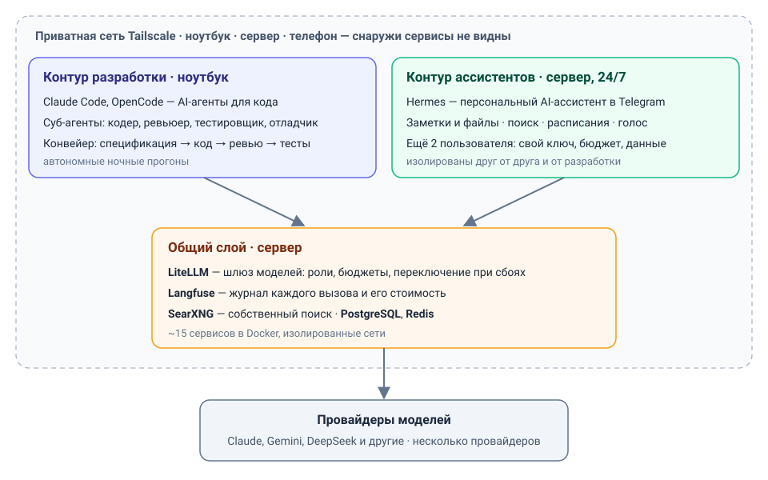
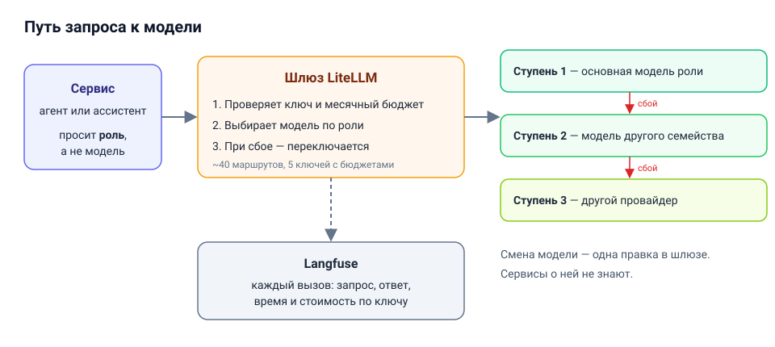
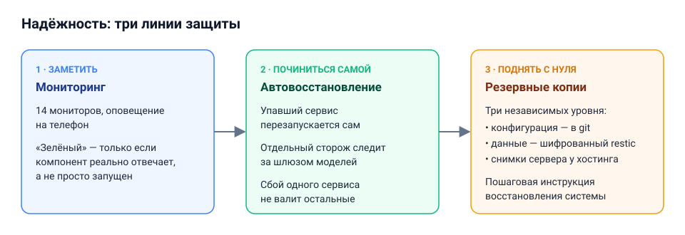

# Персональная AI-платформа

**Александр Павлов** — AI-инженер · alexxxwork9@gmail.com · Telegram [@alexxxpavlov9](https://t.me/alexxxpavlov9)

Моя личная система, которую я спроектировал, собрал и эксплуатирую: среда разработки с AI-агентами и персональный AI-ассистент на общем шлюзе моделей. Это мой ежедневный рабочий инструмент.

> Это обзор. Код и конфигурация приватны, адреса и ключи опущены.

## Коротко

- **Что:** два независимых контура — среда AI-разработки на ноутбуке и персональный AI-ассистент, который круглосуточно работает на сервере.
- **Масштаб:** ~15 сервисов в Docker на Linux-сервере, ~40 маршрутов к моделям разных провайдеров, 14 мониторов.
- **Стоимость:** $120–150 в месяц за всё; лимиты не дают выйти за ~$250 (разбивка ниже).

## Как устроено

- **Среда AI-разработки.** Claude Code и OpenCode: агенты пишут, проверяют и тестируют код по конвейеру «спецификация → код → ревью → тесты». Ревьюер работает на модели другого семейства, чтобы не повторять слепые пятна автора.
- **Персональный ассистент (Hermes).** Работает в Telegram 24/7: заметки и файлы, поиск в интернете и по личной базе знаний, задачи по расписанию, голосовые сообщения. Ассистент подключён ещё двум людям — у каждого свой бюджет и изолированные данные.
- **Шлюз моделей (LiteLLM).** Все запросы к моделям идут через одну точку: выбор модели, бюджеты, учёт расходов и переключение при сбоях.
- **Наблюдаемость (Langfuse).** Каждый вызов модели записывается: запрос, ответ, время, стоимость.
- **Приватная сеть (Tailscale).** Сервисы доступны только своим устройствам и снаружи не видны.

## Путь запроса

Сервис не выбирает модель сам — он называет роль: «кодер», «ассистент», «быстрая задача». Шлюз проверяет бюджет, подбирает модель под роль, при сбое переключается на модель другого семейства, затем на другого провайдера, и записывает вызов со стоимостью. Новая модель подключается одной правкой в шлюзе — сервисы менять не нужно.

## Надёжность

## Сколько стоит

| Статья | В месяц |
|---|---|
| Сервер (8 vCPU / 12 GB) | ~$30 |
| Подписка Claude для разработки | $20 |
| Вызовы моделей для агентов разработки | ~$30 |
| Ассистент в Telegram (мой и ещё двух человек) | ~$45 |
| Голос и генерация изображений | до $20 |
| **Обычно** | **$120–150** |

Каждый ключ ограничен месячным бюджетом, поэтому даже в самый нагруженный месяц сумма не превысит ~$250. Основная экономия — в выборе моделей: для рутины — быстрые и дешёвые, дорогие модели — только там, где они дают результат.

## Ключевые решения

1. **Разделил разработку и ассистентов.** Связка между ними была самой хрупкой частью системы. После разделения сбой в одном контуре не задевает другой.
2. **Роли вместо конкретных моделей.** Модели обновляются каждые несколько месяцев; привязка к ролям превращает замену модели в одну правку.
3. **Переключение между провайдерами — в шлюзе, а не в каждом сервисе.** Расходы и журнал вызовов остаются в одном месте, сервисы проще.
4. **Контроль расходов с первого дня.** У каждого пользователя и каждого автоматического процесса свой ключ с месячным лимитом — неожиданного счёта не бывает.
5. **Быстрое восстановление вместо дублирования сервера.** Для системы такого размера второй сервер дороже риска. Вместо него — три уровня резервных копий и пошаговая инструкция восстановления.

## Как сделано

Архитектуру и все решения принимал я; реализацию вёл вместе с AI-агентами, в основном Claude Code. Мои — постановка задач, выбор на каждой развилке, критерии качества, проверка результата и ответственность за него.

Система ведётся как продакшн-проект: ~20 документов (архитектура, инструкции восстановления и обновления, журнал техдолга), каждое изменение сверяется с живой системой, а не с памятью.

## Стек

Python · Docker · Linux · LiteLLM · Langfuse · Tailscale · PostgreSQL · Redis · SearXNG · restic · UptimeRobot · Claude Code · OpenCode · Hermes Agent · MCP · Telegram
